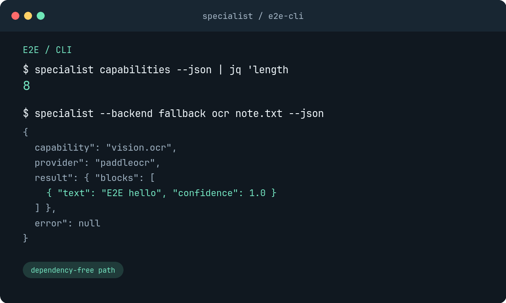
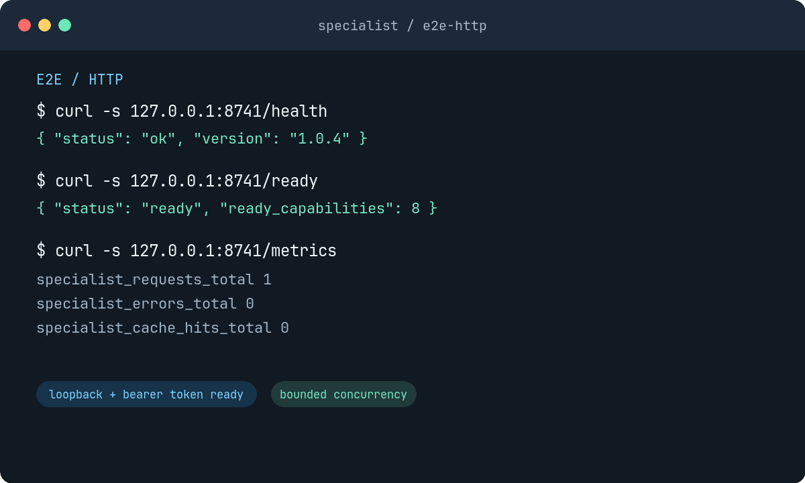
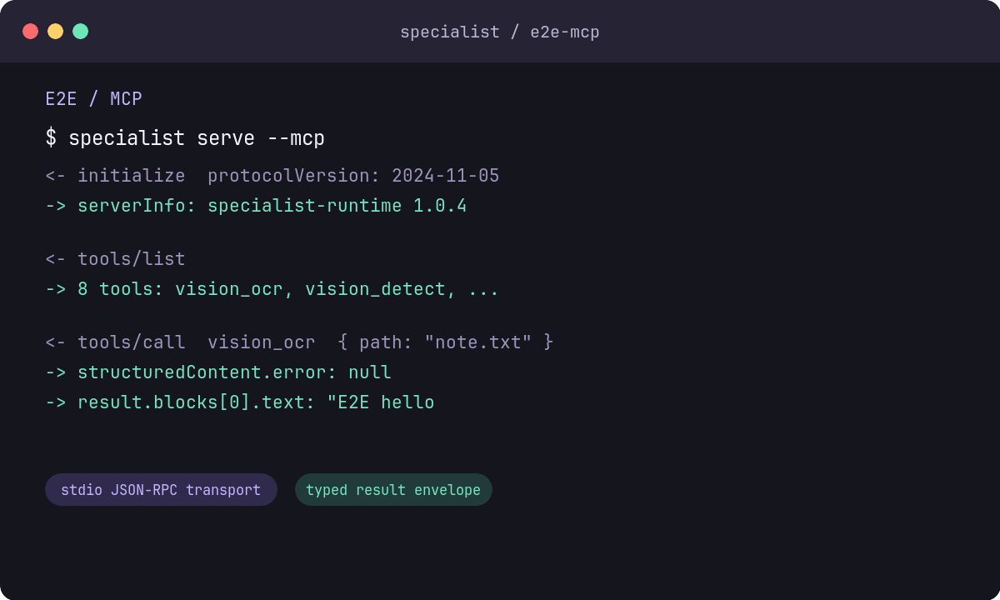

# Specialist Runtime

Give any LLM specialist superpowers.

<p align="center">
  <a href="https://github.com/TsekaLuk/specialist-runtime/actions/workflows/ci.yml"></a>
  <a href="https://github.com/TsekaLuk/specialist-runtime/releases/latest"></a>
  <a href="https://pypi.org/project/specialist-runtime/"></a>
  <a href="LICENSE"></a>
</p>

<p align="center">
  <strong>One local runtime for vision, audio, screen and document specialists.</strong><br>
  CLI &nbsp;&middot;&nbsp; Python SDK &nbsp;&middot;&nbsp; HTTP &nbsp;&middot;&nbsp; MCP
</p>

Specialist Runtime is a local-first capability layer for deterministic vision,
audio, screen and document tasks. It gives agents stable names such as
`vision.ocr` and `audio.transcribe` while providers remain replaceable.

The repository is intentionally useful on a fresh machine. The core CLI and
fallback providers use only Python's standard library; optional model providers
can be installed independently later. A small Rust core is available for stable
cache-key and input-safety primitives.

## E2E in action

These are representative captures from the dependency-free E2E suite. The
same result envelope is available through the CLI, HTTP server and MCP
transport, so an agent can switch interfaces without changing capability code.

## Real provider output

This is an actual model output from the pinned provider used by Specialist
Runtime, not a mock or an illustration. The runtime verified the Ultralytics
YOLO11s artifact by SHA256 and returned one bus plus four people with confidence
scores in the normalized result envelope.

<p align="center">
  
</p>

<p align="center"><sub>Provider: <code>yolo</code> &middot; Model: <code>yolo11s</code> &middot; Package: <code>ultralytics==8.3.0</code> &middot; Device: CPU &middot; Input: <a href="https://www.ultralytics.com/images/bus.jpg">Ultralytics bus.jpg</a></sub></p>

Reproduce the capture with the verified registry artifact:

```bash
curl -L https://www.ultralytics.com/images/bus.jpg -o bus.jpg
specialist --backend real --isolate install vision.detect \
  --source https://github.com/ultralytics/assets/releases/download/v8.3.0/yolo11s.pt \
  --sha256 85a76fe86dd8afe384648546b56a7a78580c7cb7b404fc595f97969322d502d5
specialist --backend real --isolate detect bus.jpg --json
```

<table>
  <tr>
    <td width="33%"></td>
    <td width="33%"></td>
    <td width="33%"></td>
  </tr>
  <tr>
    <td align="center"><sub><b>CLI</b> &nbsp; discover and run</sub></td>
    <td align="center"><sub><b>HTTP</b> &nbsp; health and metrics</sub></td>
    <td align="center"><sub><b>MCP</b> &nbsp; tools for any agent</sub></td>
  </tr>
</table>

Run the captures' underlying checks locally:

```bash
python -m unittest discover -s tests/e2e -v
```

## Quick start

```bash
uv tool install .
specialist doctor
specialist ocr invoice.png
specialist depth room.jpg --json
specialist --isolate ocr invoice.png --json
specialist --backend real --with-dependencies install vision.ocr
```

You can also run directly from a checkout:

```bash
python -m specialist capabilities
python -m specialist detect image.jpg --json
```

The first call lazily creates metadata under `~/.specialist/`. The bundled
provider implementations return valid schemas without downloading weights and
clearly warn that they are fallbacks. Use `--backend real` to require optional
production backends, or `--backend auto` to select them when installed. Use
`--isolate` to execute built-in providers in a separate process with timeout and
output limits. Production providers can implement the protocol in
`specialist/providers/base.py` and be registered with
`SpecialistRuntime(provider_overrides=...)`.

`--with-dependencies` creates a provider-specific environment under
`~/.specialist/environments/` using `uv` (or `venv` + `pip`) and runs the
provider worker with that environment's Python. It is explicit because provider
packages can be large and some upstream projects have platform-specific
licenses.

Provider environments are pinned to the versions exercised by the release
matrix. Re-running the command after an upgrade replaces an environment when
its recorded requirement set changes. Command providers can be pointed at
operator-managed binaries with `SPECIALIST_WHISPER_BINARY`,
`SPECIALIST_MINERU_COMMAND`, and `SPECIALIST_OMNIPARSER_COMMAND`.

Real providers are fail-closed by default: a model must be installed from a
source with a SHA256 checksum before it can be loaded. The checked-in registry
contains pinned upstream artifact URLs and auditable SHA256 digests. This is
the safe production path:

```bash
specialist --backend real --with-dependencies install vision.ocr --source https://models.example/ppocr.bin --sha256 <64-hex-digest>
```

For a controlled environment where the upstream provider's own downloader is
trusted, opt in explicitly with `--allow-unverified-models` or
`SPECIALIST_ALLOW_UNVERIFIED_MODELS=1`. This setting should not be used for
untrusted or reproducible deployments.

## Production acceptance

The release gate has two layers: dependency-free process E2E for every
interface, and opt-in real-provider acceptance against pinned artifacts. Run
the latter on a host with the provider packages installed:

```bash
SPECIALIST_RUN_REAL_PROVIDER_E2E=1 \
SPECIALIST_REAL_PROVIDERS=yolo,sam,paddleocr,silero,whisper \
python -m unittest discover -s tests/e2e -p test_real_provider_e2e.py -v
```

The supported provider contracts are:

| Provider | Production input | Offline boundary |
| --- | --- | --- |
| YOLO / SAM | `ultralytics==8.3.0` | pinned `.pt` artifact |
| PaddleOCR | `paddleocr==3.7.0`, `paddlepaddle==3.3.1` | PP-OCRv5 det/rec bundle; extra OCR stages disabled |
| Depth Anything | `transformers==4.57.3`, `torch==2.14.0` | local Hugging Face bundle (`local_files_only`) |
| Silero VAD | `silero-vad==6.2.1`, `torch==2.14.0` | verified `.jit` artifact |
| whisper.cpp | operator-provided `whisper-cli` | verified `ggml-base.en.bin` |
| MinerU | `mineru==3.4.5` | verified wheel plus operator-provisioned local pipeline models |
| OmniParser | operator-provided JSON CLI | verified bundle exposed through `OMNIPARSER_MODEL_DIR` |

MinerU and OmniParser intentionally require an operator-supplied local model
directory or wrapper because their upstream projects do not publish a single,
stable, checksum-addressable runtime artifact. In verified mode Specialist sets
`MINERU_MODEL_SOURCE=local`, `HF_HUB_OFFLINE=1`, and `TRANSFORMERS_OFFLINE=1`
for command providers; missing local weights fail closed instead of triggering
a network download. Set `SPECIALIST_MINERU_MODEL_DIR` to the provisioned
pipeline model directory before running `document.parse`. Use
`--allow-unverified-models` only as an explicit,
audited exception.

## Interfaces

Every capability returns the same envelope:

```json
{
  "capability": "vision.ocr",
  "provider": "paddleocr",
  "model": "pp-ocrv5-mobile",
  "input": {"type": "image", "path": "invoice.png"},
  "result": {"blocks": []},
  "performance": {"latency_ms": 3, "device": "cpu", "cached": false},
  "warnings": [],
  "error": null
}
```

### Python

```python
from specialist import Specialist

sp = Specialist()
result = sp.ocr("invoice.png")
print(result["result"]["blocks"])
```

### HTTP

```bash
specialist serve --port 8741
curl -s http://127.0.0.1:8741/v1/capabilities
curl -s http://127.0.0.1:8741/health
curl -s http://127.0.0.1:8741/metrics
curl -s -X POST http://127.0.0.1:8741/v1/vision/ocr \
  -H 'content-type: application/json' \
  -d '{"path":"invoice.png"}'
```

### MCP

```bash
specialist serve --mcp
```

The stdio server implements `initialize`, `tools/list`, and `tools/call` for
all eight core tools, so it works with generic MCP clients without a framework
dependency.

## Capabilities

| Capability | Provider contract | Command |
| --- | --- | --- |
| `vision.detect` | YOLO | `specialist detect` |
| `vision.segment` | SAM | `specialist segment` |
| `vision.ocr` | PaddleOCR | `specialist ocr` |
| `vision.depth` | Depth Anything V2 | `specialist depth` |
| `screen.parse` | OmniParser | `specialist parse-screen` |
| `document.parse` | MinerU | `specialist parse-document` |
| `audio.transcribe` | whisper.cpp | `specialist transcribe` |
| `audio.vad` | Silero VAD | `specialist vad` |

Bundles are available with `specialist install vision`, `audio`, `document`,
or `all`. Model and result data lives in `SPECIALIST_HOME` when set, otherwise
`~/.specialist`.

Artifact installation verifies content before replacing the destination:

```bash
specialist install vision.ocr --source file:///tmp/ppocr-model.bin --sha256 <sha256>
specialist models list
```

For a network-facing HTTP bind, configure a token:

```bash
SPECIALIST_API_TOKEN=change-me specialist serve --host 0.0.0.0 --token change-me
```

The server binds loopback by default, keeps one worker per capability warm, and
exposes Prometheus-compatible counters at `/metrics`. Non-loopback binds are
refused unless a token is configured.

See [deployment.md](docs/deployment.md) for service-manager guidance and cache
operations.

## Rust + Python

Python owns the SDK, transports and provider ecosystem. Rust owns small,
deterministic primitives that benefit from a stable native implementation. The
extension is optional:

```bash
uv tool install maturin
PYO3_USE_ABI3_FORWARD_COMPATIBILITY=1 maturin develop --manifest-path rust-core/Cargo.toml --features python
```

Without the extension, Python uses an equivalent implementation automatically.
Run Rust tests with `cargo test --manifest-path rust-core/Cargo.toml`.

## Development

The development environment is reproducible with the checked-in lockfile:

```bash
uv sync --locked
```

```bash
python -m unittest discover -s tests -v
python -m unittest discover -s tests/e2e -v
python -m specialist doctor --fix
```

The E2E suite starts real CLI, HTTP, MCP and isolated-worker subprocesses
using temporary homes and dependency-free fallback providers, so it never
downloads heavyweight model weights. To exercise the release artifact as an
installed package, install the `build` package and opt in explicitly:

```bash
python -m pip install build setuptools
SPECIALIST_RUN_PACKAGE_E2E=1 python -m unittest discover -s tests/e2e -p test_package_e2e.py -v
```

Production-provider authentication, model fixtures and hardware-specific
checks belong in a separate integration environment; the default E2E suite
keeps those external requirements out of CI.

Release tags run an additional artifact gate. Every model has an audited HTTPS
URL and SHA256 (including per-file manifests for multi-file bundles) before the
release workflow can publish a package. Tags must also match the project
version (`v<version>`). The release workflow publishes a CycloneDX SBOM and a
GitHub build-provenance attestation alongside wheel and sdist artifacts.

`doctor --fix` only changes local provider metadata when a provider explicitly
reports a repairable issue; it never downloads every model, preserving lazy
installation.

Use `doctor --strict` as a deployment gate. It exits non-zero when any
capability is unavailable, unconfigured or has a corrupt/error model state.

The project is MIT-licensed. Upstream model licenses are recorded in the
registry and must be checked before redistribution or commercial use.
