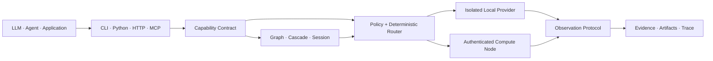

<div align="center">

# Specialist OS

**Capabilities, not models.**

The capability layer between AI applications and specialist intelligence.

[English](README.md) · [简体中文](README.zh-CN.md)

[](https://github.com/TsekaLuk/specialist-runtime/actions/workflows/ci.yml)
[](https://github.com/TsekaLuk/specialist-runtime/releases/latest)
[](https://pypi.org/project/specialist-runtime/)
[](LICENSE)

`CLI` · `Python SDK` · `HTTP` · `MCP` · `Rust core`

</div>

Specialist OS gives LLMs, agents and applications stable capability names such
as `vision.detect`, `vision.ocr` and `audio.transcribe`. The open-source
`specialist-runtime` implementation discovers providers, applies policy,
selects hardware, executes specialists and returns one normalized,
traceable result contract.

Applications depend on capabilities instead of YOLO, PaddleOCR, Whisper or any
other specific model. Providers can change without forcing application code to
change.

> **Production boundary:** the core runtime is release-gated and has no required
> third-party runtime dependencies. Optional model providers are installed in
> isolated environments and have their own real-model acceptance lane. A
> dependency-free fallback is useful for interface validation, but it is never
> presented as model-quality evidence.

## Why Specialist OS

| | What the runtime guarantees |
| --- | --- |
| **Stable by contract** | Stable capability names, input/output schemas and semantic guarantees |
| **Deterministic by default** | Policy-, hardware- and benchmark-aware routing without an LLM in the decision path |
| **Verifiable results** | Observations, evidence, provenance, confidence, metrics, artifacts and execution trace |
| **Composable execution** | DAGs, confidence cascades, fallback and stateful streaming sessions |
| **Local-first distribution** | Isolated local workers plus token-authenticated HTTP compute nodes |
| **Open provider ecosystem** | Data-only manifests, an adapter SDK, capability packs and license metadata |

## Architecture



The runtime is deliberately not an agent framework, chatbot, RAG framework or
general model gateway. It is the operating layer underneath those systems for
machine perception and specialist computation.

## Quick start

Install from a checkout with [uv](https://docs.astral.sh/uv/):

```bash
git clone https://github.com/TsekaLuk/specialist-runtime.git
cd specialist-runtime
uv tool install .

specialist doctor
specialist capabilities --json
```

Exercise the dependency-free interface path on a fresh machine:

```bash
printf 'Specialist OS' > note.txt
specialist ocr note.txt --json
```

Install and require a real provider for production inference:

```bash
specialist --backend real --with-dependencies install vision.ocr
specialist --backend real --isolate ocr invoice.png --json
```

Runtime data is stored under `~/.specialist/` by default. Set
`SPECIALIST_HOME` to use a dedicated location. Real providers fail closed when
a required model artifact is missing or does not match its registered SHA256.

## Real provider output

The image below is an actual Specialist Runtime result, not a mock or an
illustration. The runtime verified the Ultralytics YOLO11s artifact by SHA256
and returned one bus and four people with confidence scores in the normalized
result envelope.

<p align="center">
  
</p>

<p align="center"><sub>Provider: <code>yolo</code> · Model: <code>yolo11s</code> · Package: <code>ultralytics==8.3.0</code> · Device: CPU · Input: <a href="https://www.ultralytics.com/images/bus.jpg">Ultralytics bus.jpg</a></sub></p>

Reproduce it with the pinned registry artifact:

```bash
curl -L https://www.ultralytics.com/images/bus.jpg -o bus.jpg
specialist --backend real --isolate install vision.detect \
  --source https://github.com/ultralytics/assets/releases/download/v8.3.0/yolo11s.pt \
  --sha256 85a76fe86dd8afe384648546b56a7a78580c7cb7b404fc595f97969322d502d5
specialist --backend real --isolate detect bus.jpg --json
```

## Core capabilities

| Capability | Reference provider | CLI |
| --- | --- | --- |
| `vision.detect` | YOLO | `specialist detect` |
| `vision.segment` | SAM | `specialist segment` |
| `vision.ocr` | PaddleOCR | `specialist ocr` |
| `vision.depth` | Depth Anything V2 | `specialist depth` |
| `screen.parse` | OmniParser | `specialist parse-screen` |
| `document.parse` | MinerU | `specialist parse-document` |
| `audio.transcribe` | whisper.cpp | `specialist transcribe` |
| `audio.vad` | Silero VAD | `specialist vad` |

Install a capability, a pack or the complete reference set:

```bash
specialist install vision.ocr
specialist pack list
specialist pack install vision-core
specialist install all
```

## Advanced runtime

Inspect the provider decision and every rejected candidate without running
inference:

```bash
specialist explain vision.depth \
  --options '{"profile":"quality","max_memory_mb":4096}'
```

Validate and catalog a third-party manifest without importing its code:

```bash
specialist provider validate ./manifest.json
specialist provider install ./manifest.json
specialist provider list
```

Measure real local execution and inspect the control plane:

```bash
specialist bench vision.ocr invoice.png --runs 5
specialist node list
specialist studio snapshot
```

Compose registered capabilities as a DAG and open a stateful session through
the Python SDK:

```python
from specialist import Specialist

sp = Specialist()

graph = sp.graph("document-inspection")
graph.add("ocr", "vision.ocr")
graph.add("depth", "vision.depth")
graph.add("scene", "screen.parse", depends_on=("ocr", "depth"))
run = sp.runtime.run_graph(graph, "page.png")

session = sp.open_session("audio.vad")
event = session.push(audio_bytes)
events = session.poll()
session.close()
```

Every successful result implements the
[Observation Protocol schema](schemas/result-envelope.schema.json). Large
provider outputs are placed in the content-addressed artifact store rather than
embedded in JSON. Artifact IDs are SHA256-verifiable, and artifact resolution
rejects symlink traversal.

## Interfaces

### Python

```python
from specialist import Specialist

sp = Specialist(backend="real", isolate=True)
result = sp.ocr("invoice.png")
print(result["result"]["blocks"])
```

### HTTP

The server binds to loopback by default. Non-loopback binds are refused unless
a bearer token is configured.

```bash
export SPECIALIST_API_TOKEN="$(openssl rand -hex 32)"
specialist serve --port 8741 --token "$SPECIALIST_API_TOKEN"

curl -s http://127.0.0.1:8741/health
curl -s http://127.0.0.1:8741/ready
curl -s http://127.0.0.1:8741/metrics
curl -s -X POST http://127.0.0.1:8741/v1/vision/ocr \
  -H "Authorization: Bearer $SPECIALIST_API_TOKEN" \
  -H 'Content-Type: application/json' \
  -d '{"path":"invoice.png"}'
```

### MCP

```bash
specialist serve --mcp
```

The stdio server implements `initialize`, `tools/list` and `tools/call` for all
eight core tools. Tool definitions are derived from the capability registry.

## Production acceptance

The default E2E lane starts real CLI, HTTP, MCP, worker and remote-node process
boundaries using temporary runtime homes. It validates transport and lifecycle
behavior without downloading model weights:

```bash
python -m unittest discover -s tests/e2e -v
```

The executable evidence lives in
[CLI E2E](tests/e2e/test_cli_e2e.py),
[HTTP E2E](tests/e2e/test_http_e2e.py),
[MCP E2E](tests/e2e/test_mcp_e2e.py) and
[remote-node E2E](tests/e2e/test_remote_e2e.py). There are no handcrafted E2E
screenshots in this README.

Run the separate real-provider acceptance lane on a host with the provider
packages and pinned model artifacts installed:

```bash
SPECIALIST_RUN_REAL_PROVIDER_E2E=1 \
SPECIALIST_REAL_PROVIDERS=yolo,sam,paddleocr,silero,whisper \
python -m unittest discover -s tests/e2e -p test_real_provider_e2e.py -v
```

| Provider | Production dependency | Offline boundary |
| --- | --- | --- |
| YOLO / SAM | `ultralytics==8.3.0` | pinned `.pt` artifact |
| PaddleOCR | `paddleocr==3.7.0`, `paddlepaddle==3.3.1` | PP-OCRv5 det/rec bundle; extra stages disabled |
| Depth Anything | `transformers==4.57.3`, `torch==2.14.0` | local Hugging Face bundle with `local_files_only` |
| Silero VAD | `silero-vad==6.2.1`, `torch==2.14.0` | verified `.jit` artifact |
| whisper.cpp | operator-provided `whisper-cli` | verified `ggml-base.en.bin` |
| MinerU | `mineru==3.4.5` | verified wheel plus operator-provisioned local models |
| OmniParser | operator-provided JSON CLI | verified bundle via `OMNIPARSER_MODEL_DIR` |

Before production promotion:

```bash
specialist --backend real doctor --strict --json
python scripts/release_check.py --require-artifacts
SPECIALIST_RUN_PACKAGE_E2E=1 \
  python -m unittest discover -s tests/e2e -p test_package_e2e.py -v
```

Keep network services token-protected, execute third-party providers in isolated
workers, and review upstream code and weight licenses. See the
[deployment guide](docs/deployment.md) and [security policy](SECURITY.md) for
the complete production boundary.

## Rust + Python

Python owns the SDK, transports and provider ecosystem. Rust owns small,
deterministic primitives that benefit from native speed, strong types and a
stable implementation. The extension is optional:

```bash
uv tool install maturin
PYO3_USE_ABI3_FORWARD_COMPATIBILITY=1 \
  maturin develop --manifest-path rust-core/Cargo.toml --features python
```

Without the extension, Python selects an equivalent implementation
automatically.

## Development

```bash
uv sync --locked
python -m unittest discover -s tests -v
python -m unittest discover -s tests/e2e -v
cargo test --manifest-path rust-core/Cargo.toml
python scripts/release_check.py --require-artifacts
```

CI covers Python 3.10–3.13, macOS ARM64, wheel installation, Rust/Python ABI
checks, `pip-audit`, `cargo audit`, release metadata and CycloneDX SBOM
generation. Release tags also publish checksums and build provenance.

Contributions are welcome. Read [CONTRIBUTING.md](CONTRIBUTING.md) before adding
a provider or changing a capability contract.

Specialist Runtime is released under the [MIT License](LICENSE). Provider code
and model weights retain their own licenses as recorded in the registry.
