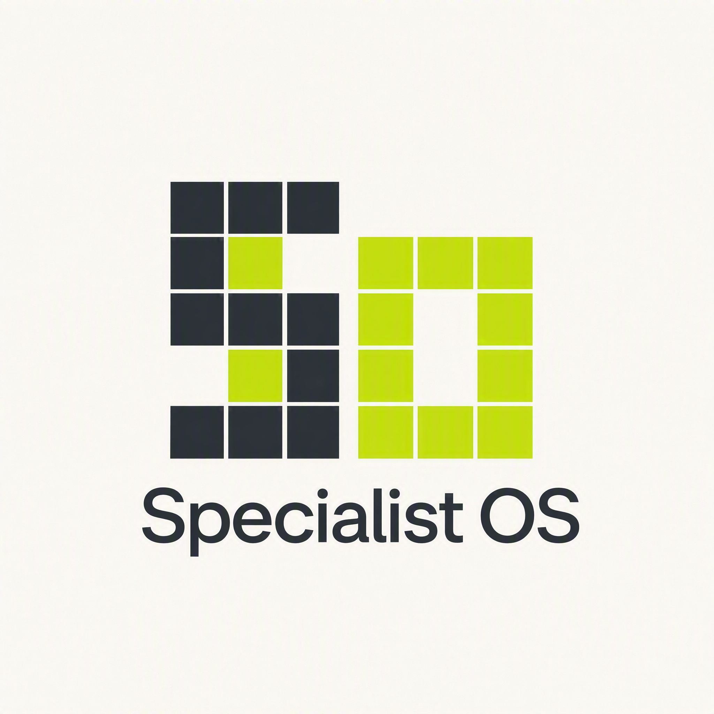
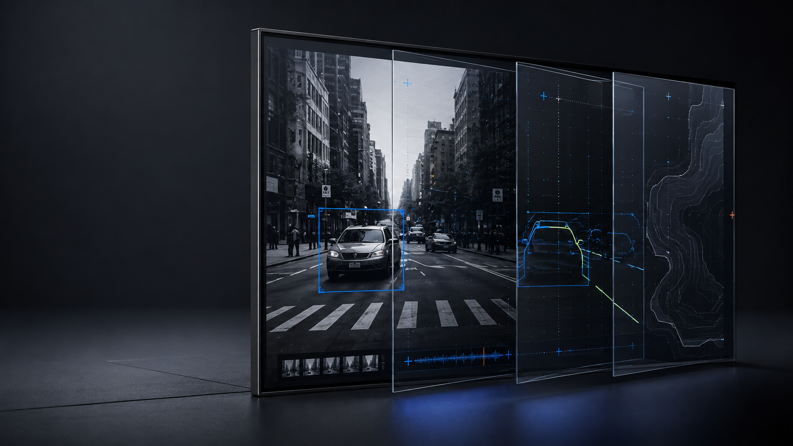
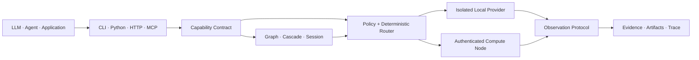
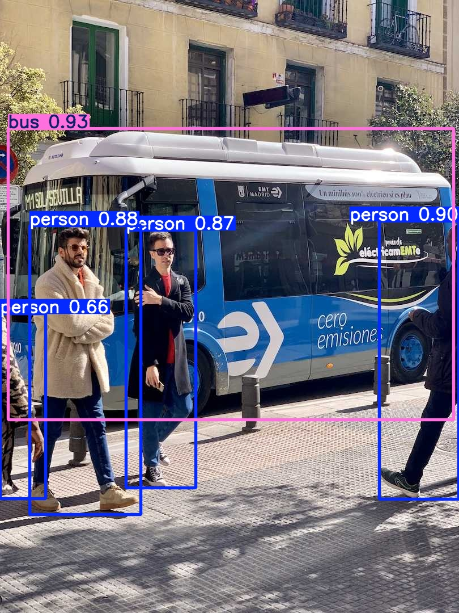

<div align="center">



# Specialist OS

**Turn specialist intelligence into product capabilities.**

The capability layer between AI applications and specialist intelligence.

[English](README.md) · [简体中文](README.zh-CN.md)

[](https://github.com/TsekaLuk/specialist-runtime/actions/workflows/ci.yml)
[](https://github.com/TsekaLuk/specialist-runtime/releases/latest)
[](pyproject.toml)
[](LICENSE)

`CLI` · `Python SDK` · `HTTP` · `MCP` · `Rust core`

</div>

<p align="center">
  
</p>

Specialist OS is the capability layer for AI products that need to see, hear,
read and speak. It turns specialist intelligence into product primitives for
object detection, segmentation, OCR, depth, screen understanding, document
extraction, transcription and speech, ready to flow into real product workflows.

The open-source `specialist-runtime` implementation discovers providers, chooses
the right execution path for the request, and returns one result contract that
your application can build on. Your product talks to a capability; the runtime
handles models, hardware, isolation and provider changes underneath it.

That separation shortens the path from an idea to a shippable feature. Teams can
launch with the best available model, switch providers as quality or economics
change, and keep the application API stable while the intelligence layer keeps
improving.

## Why teams build on Specialist OS

| | Product value |
| --- | --- |
| **Stable product APIs** | Ship against durable capability names and schemas while models evolve |
| **Faster iteration** | Add or replace specialist providers while keeping the application layer stable |
| **Cost and latency control** | Route by policy, hardware and benchmark data so each request gets the right execution path |
| **Trustworthy automation** | Return confidence, provenance, evidence, metrics, artifacts and an execution trace with every result |
| **One system, many surfaces** | Reuse the same capabilities from a CLI, Python SDK, HTTP service or MCP client |
| **Built for sensitive data** | Keep workloads local when required, or send them to authenticated compute nodes when scale matters |

## Architecture



Specialist OS sits underneath agent frameworks, chatbots, RAG products and
model-powered workflows, giving them a dependable operating layer for machine
perception and specialist computation.

## Quick start

Install from a checkout with [uv](https://docs.astral.sh/uv/):

```bash
git clone https://github.com/TsekaLuk/specialist-runtime.git
cd specialist-runtime
uv tool install .

specialist doctor
specialist capabilities --json
```

Quickly verify the interface path on a fresh machine:

```bash
printf 'Specialist OS' > note.txt
specialist ocr note.txt --json
```

Install a production provider for inference:

```bash
specialist --backend real --with-dependencies install vision.ocr
specialist --backend real --isolate ocr invoice.png --json
```

Runtime data is stored under `~/.specialist/` by default. Set
`SPECIALIST_HOME` to use a dedicated location. Registered model artifacts are
checked for availability and SHA256 integrity before execution.

## Capability showcase

Every capability has a clear product job and a measurable evaluation surface:
compare quality, latency and resource cost per route without changing your
application integration. The reference providers below cover visual perception,
document intelligence, interface understanding and voice, while sharing one
result contract and the same routing, caching and deployment surface.

| Capability | Reference intelligence | Product outcome | CLI |
| --- | --- | --- | --- |
| `vision.detect` | YOLO | Find people, vehicles, products and safety events in live or recorded images | `specialist detect` |
| `vision.segment` | SAM | Turn an object into a precise pixel mask for editing, inspection or robotics | `specialist segment` |
| `vision.ocr` | PaddleOCR | Convert invoices, forms and screenshots into searchable structured text | `specialist ocr` |
| `vision.depth` | Depth Anything V2 | Add spatial understanding to AR, navigation and scene automation | `specialist depth` |
| `screen.parse` | OmniParser | Turn a screen into actionable UI targets for agents and testing | `specialist parse-screen` |
| `document.parse` | MinerU | Extract layout, tables and content from PDFs and office documents | `specialist parse-document` |
| `audio.transcribe` | whisper.cpp | Bring meetings, calls and media into search and workflow automation | `specialist transcribe` |
| `audio.vad` | Silero VAD | Detect speech intervals for responsive, low-latency voice experiences | `specialist vad` |
| `speech.synthesize` | Fish Audio S2 / system TTS | Give assistants, products and content pipelines a consistent voice | `specialist speak` |
| `speech.clone_voice` | Fish Audio S2 | Create a controlled voice identity for a defined product or content workflow | `specialist clone-voice` |

### One contract, many workflows

Combine capabilities into a single product flow: detect and segment an object,
read the text around it, estimate its depth, then hand the structured result to
an agent or a customer-facing feature. The runtime keeps provider selection,
artifacts, confidence and provenance consistent across every step.

<p align="center">
  
</p>

<p align="center"><sub>Live reference result · <code>yolo</code> / <code>yolo11s</code> · CPU · <a href="https://www.ultralytics.com/images/bus.jpg">Ultralytics bus.jpg</a></sub></p>

Reproduce the result with the pinned registry artifact:

```bash
curl -L https://www.ultralytics.com/images/bus.jpg -o bus.jpg
specialist --backend real --isolate install vision.detect \
  --source https://github.com/ultralytics/assets/releases/download/v8.3.0/yolo11s.pt \
  --sha256 85a76fe86dd8afe384648546b56a7a78580c7cb7b404fc595f97969322d502d5
specialist --backend real --isolate detect bus.jpg --json
```

Install one capability, a pack or the complete reference set:

```bash
specialist install vision.ocr
specialist pack list
specialist pack install vision-core
specialist install all
```

Speech capabilities use Fish Audio S2 or the host system TTS through the same
capability layer. Configure the Fish server when voice synthesis or cloning is
part of your product deployment; the [deployment guide](docs/deployment.md)
covers server lifecycle, licensing and voice-data policy.

## Advanced runtime

Inspect the provider decision and each candidate's selection reason before
running inference:

```bash
specialist explain vision.depth \
  --options '{"profile":"quality","max_memory_mb":4096}'
```

Validate and catalog a third-party manifest from its declared metadata:

```bash
specialist provider validate ./manifest.json
specialist provider install ./manifest.json
specialist provider list
```

Measure real local execution and inspect the control plane:

```bash
specialist bench vision.ocr invoice.png --runs 5
specialist node list
specialist studio snapshot
```

Compose registered capabilities as a DAG and open a stateful session through
the Python SDK:

```python
from specialist import Specialist

sp = Specialist()

graph = sp.graph("document-inspection")
graph.add("ocr", "vision.ocr")
graph.add("depth", "vision.depth")
graph.add("scene", "screen.parse", depends_on=("ocr", "depth"))
run = sp.runtime.run_graph(graph, "page.png")

session = sp.open_session("audio.vad")
event = session.push(audio_bytes)
events = session.poll()
session.close()
```

Every successful result implements the
[Observation Protocol schema](schemas/result-envelope.schema.json). Large
provider outputs live in the content-addressed artifact store and travel as
small, verifiable references. Artifact IDs are SHA256-verifiable, and artifact
resolution follows safe path rules.

## Interfaces

### Python

```python
from specialist import Specialist

sp = Specialist(backend="real", isolate=True)
result = sp.ocr("invoice.png")
print(result["result"]["blocks"])
```

### HTTP

The server binds to loopback by default. Public or private-network binds use
bearer-token protection.

```bash
export SPECIALIST_API_TOKEN="$(openssl rand -hex 32)"
specialist serve --port 8741 --token "$SPECIALIST_API_TOKEN"

curl -s http://127.0.0.1:8741/health
curl -s http://127.0.0.1:8741/ready
curl -s http://127.0.0.1:8741/metrics
curl -s -X POST http://127.0.0.1:8741/v1/vision/ocr \
  -H "Authorization: Bearer $SPECIALIST_API_TOKEN" \
  -H 'Content-Type: application/json' \
  -d '{"path":"invoice.png"}'
```

### MCP

```bash
specialist serve --mcp
```

The stdio server implements `initialize`, `tools/list` and `tools/call` for all
registered tools, including speech synthesis and voice cloning. Tool
definitions are derived from the capability registry.

## Built for production

Specialist OS ships with the operating pieces around specialist models:
isolated workers, authenticated HTTP nodes, health and readiness probes,
metrics, content-addressed artifacts, policy-driven routing and a normalized
observation protocol. The same capabilities can run in a laptop workflow, a
private service or a distributed worker pool.

Run the end-to-end suite locally:

```bash
python -m unittest discover -s tests/e2e -v
```

Run the Fish Audio integration against a live S2 Server:

```bash
SPECIALIST_RUN_FISH_AUDIO_E2E=1 \
SPECIALIST_FISH_AUDIO_URL=http://127.0.0.1:8080 \
python -m unittest tests.e2e.test_real_fish_audio_e2e -v
```

For a provider-backed deployment, install the provider package and its pinned
artifacts. Fish Audio uses an operator-managed HTTP server, so the model stays
with the GPU service while your application keeps the same capability API.

Before a release:

```bash
specialist --backend real doctor --strict --json
python scripts/release_check.py --require-artifacts
SPECIALIST_RUN_PACKAGE_E2E=1 \
  python -m unittest discover -s tests/e2e -p test_package_e2e.py -v
```

See the [deployment guide](docs/deployment.md) and [security policy](SECURITY.md)
for deployment configuration and operational controls.

## Rust + Python

Python owns the SDK, transports and provider ecosystem. Rust owns small,
deterministic primitives that benefit from native speed, strong types and a
stable implementation. The extension is optional:

```bash
uv tool install maturin
PYO3_USE_ABI3_FORWARD_COMPATIBILITY=1 \
  maturin develop --manifest-path rust-core/Cargo.toml --features python
```

Python selects an equivalent implementation automatically when the extension is
unavailable.

## Development

```bash
uv sync --locked
python -m unittest discover -s tests -v
python -m unittest discover -s tests/e2e -v
cargo test --manifest-path rust-core/Cargo.toml
python scripts/release_check.py --require-artifacts
```

CI covers Python 3.10–3.13, macOS ARM64, wheel installation, Rust/Python ABI
checks, `pip-audit`, `cargo audit`, release metadata and CycloneDX SBOM
generation. Release tags also publish checksums and build provenance.

Contributions are welcome. Read [CONTRIBUTING.md](CONTRIBUTING.md) before adding
a provider or changing a capability contract.

Specialist Runtime is released under the [MIT License](LICENSE). Provider code
and model weights retain their own licenses as recorded in the registry.
