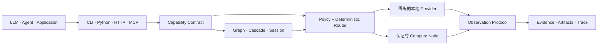

<div align="center">


# Specialist OS

**把专业智能变成产品能力。**

连接 AI 应用与专业智能的能力层。

[English](README.md) · [简体中文](README.zh-CN.md)

[](https://github.com/TsekaLuk/specialist-runtime/actions/workflows/ci.yml)
[](https://github.com/TsekaLuk/specialist-runtime/releases/latest)
[](https://pypi.org/project/specialist-runtime/)
[](LICENSE)

`CLI` · `Python SDK` · `HTTP` · `MCP` · `Rust Core`

</div>

<p align="center">
  
</p>

Specialist OS 是面向 AI 产品的能力层，让应用直接获得看、听、读、说的能力。
它把目标检测、分割、OCR、深度、界面理解、文档解析、转写和语音等专业智能封装
成稳定的产品原语，让能力可以直接进入真实业务流程。

开源实现 `specialist-runtime` 负责发现 Provider、根据请求选择执行路径，并返回
统一的结果协议。你的产品只依赖能力名称；模型、硬件、隔离和 Provider 的变化由
Runtime 在底层处理。

这样的分层让想法更快变成可上线的功能：可以用当前最合适的模型启动，随着质量和
成本变化替换 Provider，同时保持业务 API 稳定，让智能层持续进化。

## 为什么团队选择 Specialist OS

| | 产品价值 |
| --- | --- |
| **稳定的产品 API** | 依赖持久的能力名称和 Schema，模型可以持续升级 |
| **更快迭代** | 增加或替换专业 Provider，应用层保持稳定 |
| **成本与延迟可控** | 根据策略、硬件和 Benchmark 路由，为每次请求选择合适的执行路径 |
| **自动化可追溯** | 每个结果都带有置信度、来源、证据、指标、Artifact 和执行 Trace |
| **一次接入，多处复用** | CLI、Python SDK、HTTP 服务和 MCP 客户端共享同一套能力 |
| **适配敏感数据** | 需要时保持本地执行，也可以交给认证的 Compute Node 扩展规模 |

## 架构



Specialist OS 位于 Agent Framework、Chatbot、RAG 产品和各类模型应用之下，
为机器感知与专业计算提供稳定的运行层。

## 快速开始

使用 [uv](https://docs.astral.sh/uv/) 从源码安装：

```bash
git clone https://github.com/TsekaLuk/specialist-runtime.git
cd specialist-runtime
uv tool install .

specialist doctor
specialist capabilities --json
```

在全新机器上快速验证接口链路：

```bash
printf 'Specialist OS' > note.txt
specialist ocr note.txt --json
```

安装生产 Provider 完成推理：

```bash
specialist --backend real --with-dependencies install vision.ocr
specialist --backend real --isolate ocr invoice.png --json
```

Runtime 数据默认保存在 `~/.specialist/`。可以通过 `SPECIALIST_HOME` 指定独立
目录。注册的模型 Artifact 会在执行前完成存在性和 SHA256 完整性校验。

## 能力展示

每项能力都对应一个明确的产品任务，也是可量化的评估面：可以在不改业务接入的前提
下比较每条路由的质量、延迟和资源成本。参考 Provider 覆盖视觉感知、文档理解、界面
操作和语音，同时共享同一套结果协议、路由、缓存与部署方式。

| Capability | 参考智能 | 产品结果 | CLI |
| --- | --- | --- | --- |
| `vision.detect` | YOLO | 在实时或录制图像中识别人、车辆、商品和安全事件 | `specialist detect` |
| `vision.segment` | SAM | 生成精确到像素的目标掩码，用于编辑、质检和机器人流程 | `specialist segment` |
| `vision.ocr` | PaddleOCR | 把发票、表单和截图转成可搜索的结构化文字 | `specialist ocr` |
| `vision.depth` | Depth Anything V2 | 为 AR、导航和场景自动化提供空间理解 | `specialist depth` |
| `screen.parse` | OmniParser | 把屏幕解析成 Agent 和测试可以操作的 UI 目标 | `specialist parse-screen` |
| `document.parse` | MinerU | 从 PDF 和办公文档中提取版面、表格和正文 | `specialist parse-document` |
| `audio.transcribe` | whisper.cpp | 把会议、通话和媒体内容接入搜索与流程自动化 | `specialist transcribe` |
| `audio.vad` | Silero VAD | 检测语音区间，构建响应更快的实时语音体验 | `specialist vad` |
| `speech.synthesize` | Fish Audio S2 / 系统 TTS | 为助手、产品和内容生产线提供一致的声音 | `specialist speak` |
| `speech.clone_voice` | Fish Audio S2 | 为明确的产品或内容流程建立可控的声音身份 | `specialist clone-voice` |

### 一套契约，组合出完整流程

可以把多项能力串成一条产品流程：先检测并分割目标，再读取周边文字、估计场景
深度，最后把结构化结果交给 Agent 或面向客户的功能。Runtime 让每一步都保持一致
的 Provider 选择、Artifact、置信度和来源信息。

<p align="center">
  
</p>

<p align="center"><sub>实际参考结果 · <code>yolo</code> / <code>yolo11s</code> · CPU · <a href="https://www.ultralytics.com/images/bus.jpg">Ultralytics bus.jpg</a></sub></p>

使用 Registry 中锁定的 Artifact 复现：

```bash
curl -L https://www.ultralytics.com/images/bus.jpg -o bus.jpg
specialist --backend real --isolate install vision.detect \
  --source https://github.com/ultralytics/assets/releases/download/v8.3.0/yolo11s.pt \
  --sha256 85a76fe86dd8afe384648546b56a7a78580c7cb7b404fc595f97969322d502d5
specialist --backend real --isolate detect bus.jpg --json
```

安装单项能力、Capability Pack 或完整参考能力集：

```bash
specialist install vision.ocr
specialist pack list
specialist pack install vision-core
specialist install all
```

语音能力通过同一套 Capability API 接入 Fish Audio S2 或主机系统 TTS。部署语音合成
或声音克隆时，参见[部署指南](docs/deployment.md)了解 Server 生命周期、许可证和
声音数据策略。

## Advanced Runtime

在运行推理前，先检查 Provider 选择与每个候选的决策原因：

```bash
specialist explain vision.depth \
  --options '{"profile":"quality","max_memory_mb":4096}'
```

基于 Provider Manifest 的声明信息完成校验和登记：

```bash
specialist provider validate ./manifest.json
specialist provider install ./manifest.json
specialist provider list
```

测量真实本地执行，并检查控制平面：

```bash
specialist bench vision.ocr invoice.png --runs 5
specialist node list
specialist studio snapshot
```

通过 Python SDK 把已注册能力组成 DAG，并打开有状态 Session：

```python
from specialist import Specialist

sp = Specialist()

graph = sp.graph("document-inspection")
graph.add("ocr", "vision.ocr")
graph.add("depth", "vision.depth")
graph.add("scene", "screen.parse", depends_on=("ocr", "depth"))
run = sp.runtime.run_graph(graph, "page.png")

session = sp.open_session("audio.vad")
event = session.push(audio_bytes)
events = session.poll()
session.close()
```

每个成功结果都遵循
[Observation Protocol Schema](schemas/result-envelope.schema.json)。较大的 Provider
输出写入内容寻址 Artifact Store，并以小体积、可校验的引用在系统间传递。Artifact
ID 可以通过 SHA256 校验，解析路径遵循安全路径规则。

## 调用接口

### Python

```python
from specialist import Specialist

sp = Specialist(backend="real", isolate=True)
result = sp.ocr("invoice.png")
print(result["result"]["blocks"])
```

### HTTP

Server 默认只监听 loopback。对外或内网监听时使用 Bearer Token 保护访问。

```bash
export SPECIALIST_API_TOKEN="$(openssl rand -hex 32)"
specialist serve --port 8741 --token "$SPECIALIST_API_TOKEN"

curl -s http://127.0.0.1:8741/health
curl -s http://127.0.0.1:8741/ready
curl -s http://127.0.0.1:8741/metrics
curl -s -X POST http://127.0.0.1:8741/v1/vision/ocr \
  -H "Authorization: Bearer $SPECIALIST_API_TOKEN" \
  -H 'Content-Type: application/json' \
  -d '{"path":"invoice.png"}'
```

### MCP

```bash
specialist serve --mcp
```

stdio Server 为 Registry 中的全部工具（包括语音合成和声音克隆）实现
`initialize`、`tools/list` 和 `tools/call`。工具定义由 Capability Registry 生成。

## 面向生产构建

Specialist OS 将专业模型周边的运行能力一并交付：隔离 Worker、认证的 HTTP Node、
健康与就绪探针、Metrics、内容寻址 Artifact、策略路由和统一 Observation Protocol。
同一套能力可以运行在个人电脑、私有服务或分布式 Worker 集群中。

在本地运行端到端测试：

```bash
python -m unittest discover -s tests/e2e -v
```

连接正在运行的 Fish Audio S2 Server 执行真实联调：

```bash
SPECIALIST_RUN_FISH_AUDIO_E2E=1 \
SPECIALIST_FISH_AUDIO_URL=http://127.0.0.1:8080 \
python -m unittest tests.e2e.test_real_fish_audio_e2e -v
```

Provider-backed 部署使用锁定版本的 Provider Package 和模型 Artifact。Fish Audio
使用运维管理的 HTTP Server，模型留在 GPU 服务中，应用仍然调用同一套 Capability API。

发布前执行：

```bash
specialist --backend real doctor --strict --json
python scripts/release_check.py --require-artifacts
SPECIALIST_RUN_PACKAGE_E2E=1 \
  python -m unittest discover -s tests/e2e -p test_package_e2e.py -v
```

部署配置和运行控制参见[部署指南](docs/deployment.md)与[安全策略](SECURITY.md)。

## Rust + Python

Python 负责 SDK、传输层与 Provider 生态；Rust 负责适合原生实现的确定性原语，
提供更快执行、强类型和稳定实现。Rust 扩展是可选项：

```bash
uv tool install maturin
PYO3_USE_ABI3_FORWARD_COMPATIBILITY=1 \
  maturin develop --manifest-path rust-core/Cargo.toml --features python
```

Python 默认提供兼容实现，也可以切换到 Rust 原生扩展。

## 开发

```bash
uv sync --locked
python -m unittest discover -s tests -v
python -m unittest discover -s tests/e2e -v
cargo test --manifest-path rust-core/Cargo.toml
python scripts/release_check.py --require-artifacts
```

CI 覆盖 Python 3.10–3.13、macOS ARM64、Wheel 安装、Rust/Python ABI 检查、
`pip-audit`、`cargo audit`、发布元数据和 CycloneDX SBOM 生成。Release Tag 还会
发布 Checksum 与 Build Provenance。

欢迎参与贡献。新增 Provider 或修改 Capability Contract 前，请阅读
[CONTRIBUTING.md](CONTRIBUTING.md)。

Specialist Runtime 使用 [MIT License](LICENSE)。Provider 代码和模型权重保留各自
许可证，具体记录在 Registry 中。
