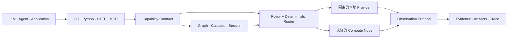

<div align="center">

# Specialist OS

**依赖能力，而不是模型。**

连接 AI 应用与专业智能的能力层。

[English](README.md) · [简体中文](README.zh-CN.md)

[](https://github.com/TsekaLuk/specialist-runtime/actions/workflows/ci.yml)
[](https://github.com/TsekaLuk/specialist-runtime/releases/latest)
[](https://pypi.org/project/specialist-runtime/)
[](LICENSE)

`CLI` · `Python SDK` · `HTTP` · `MCP` · `Rust Core`

</div>

Specialist OS 是面向 AI 产品的能力层，让应用直接获得看、听、读、说的能力。
它把专业智能封装成 `vision.detect`、`vision.ocr`、`audio.transcribe`、
`speech.synthesize` 等稳定的产品原语。

开源实现 `specialist-runtime` 负责发现 Provider、根据请求选择执行路径，并返回
统一的结果协议。你的产品只依赖能力名称；模型、硬件、隔离和 Provider 的变化由
Runtime 在底层处理。

这样的分层让想法更快变成可上线的功能：可以用当前最合适的模型启动，随着质量和
成本变化替换 Provider，同时保持业务 API 稳定，让智能层持续进化。

## 为什么团队选择 Specialist OS

| | 产品价值 |
| --- | --- |
| **稳定的产品 API** | 依赖持久的能力名称和 Schema，不被具体模型调用绑住 |
| **更快迭代** | 增加或替换专业 Provider，无需重写应用层 |
| **成本与延迟可控** | 根据策略、硬件和 Benchmark 路由，为每次请求选择合适的执行路径 |
| **自动化可追溯** | 每个结果都带有置信度、来源、证据、指标、Artifact 和执行 Trace |
| **一次接入，多处复用** | CLI、Python SDK、HTTP 服务和 MCP 客户端共享同一套能力 |
| **适配敏感数据** | 需要时保持本地执行，也可以交给认证的 Compute Node 扩展规模 |

## 架构



Specialist OS 位于 Agent Framework、Chatbot、RAG 产品和各类模型应用之下，
为机器感知与专业计算提供稳定的运行层。

## 快速开始

使用 [uv](https://docs.astral.sh/uv/) 从源码安装：

```bash
git clone https://github.com/TsekaLuk/specialist-runtime.git
cd specialist-runtime
uv tool install .

specialist doctor
specialist capabilities --json
```

在全新机器上验证无依赖接口链路：

```bash
printf 'Specialist OS' > note.txt
specialist ocr note.txt --json
```

安装并强制使用真实 Provider 完成生产推理：

```bash
specialist --backend real --with-dependencies install vision.ocr
specialist --backend real --isolate ocr invoice.png --json
```

Runtime 数据默认保存在 `~/.specialist/`。可以通过 `SPECIALIST_HOME` 指定独立
目录。真实 Provider 缺少必要模型 Artifact 或 SHA256 校验失败时会直接拒绝执行。

## 看看实际效果

下面的检测使用锁定版本的 Ultralytics YOLO11s Provider，在统一结果协议中返回了
1 辆公交车和 4 个人及其置信度。同一份结果契约可以被所有接口复用，让原型流程
自然演进为后台任务或面向客户的功能，无需再次集成。

<p align="center">
  
</p>

<p align="center"><sub>Provider：<code>yolo</code> · Model：<code>yolo11s</code> · Package：<code>ultralytics==8.3.0</code> · Device：CPU · Input：<a href="https://www.ultralytics.com/images/bus.jpg">Ultralytics bus.jpg</a></sub></p>

使用 Registry 中锁定的 Artifact 复现：

```bash
curl -L https://www.ultralytics.com/images/bus.jpg -o bus.jpg
specialist --backend real --isolate install vision.detect \
  --source https://github.com/ultralytics/assets/releases/download/v8.3.0/yolo11s.pt \
  --sha256 85a76fe86dd8afe384648546b56a7a78580c7cb7b404fc595f97969322d502d5
specialist --backend real --isolate detect bus.jpg --json
```

## 核心能力

| Capability | 参考 Provider | CLI |
| --- | --- | --- |
| `vision.detect` | YOLO | `specialist detect` |
| `vision.segment` | SAM | `specialist segment` |
| `vision.ocr` | PaddleOCR | `specialist ocr` |
| `vision.depth` | Depth Anything V2 | `specialist depth` |
| `screen.parse` | OmniParser | `specialist parse-screen` |
| `document.parse` | MinerU | `specialist parse-document` |
| `audio.transcribe` | whisper.cpp | `specialist transcribe` |
| `audio.vad` | Silero VAD | `specialist vad` |
| `speech.synthesize` | Fish Audio S2 / 系统 TTS fallback | `specialist speak` |
| `speech.clone_voice` | Fish Audio S2 | `specialist clone-voice` |

可以安装单项能力、Capability Pack 或完整参考能力集：

```bash
specialist install vision.ocr
specialist pack list
specialist pack install vision-core
specialist install all
```

### 用 Fish Audio 打造产品声音

声音本身就是产品资产：统一的品牌旁白、熟悉的智能助手、自然交流的客服，或支持
多语言发布的内容生产线。Fish Audio S2 在同一能力层提供高保真合成和声音克隆，
无需让业务代码绑定某个模型运行时，就能把这些体验接入产品。

Fish Audio 以隔离的 HTTP Provider 进程运行。可以连接运维启动的 Fish Server，也
可以配置按需启动命令：

```bash
export SPECIALIST_FISH_AUDIO_URL=http://127.0.0.1:8080
export SPECIALIST_FISH_AUDIO_COMMAND='fish-speech-server --listen 127.0.0.1:8080'
specialist provider install fish_audio
specialist provider start fish_audio
specialist speak '来自 Specialist OS 的高保真语音' --profile quality --json
```

生成结果写入内容寻址 Artifact Store，并返回 `artifact://` 引用，便于缓存、审计和
跨服务传递。声音引用必须显式导入，并且默认保留在本地：

```bash
specialist voice import ./reference.wav --name my-voice
specialist speak '使用我的声音' --voice voice://my-voice --provider fish_audio --json
specialist clone-voice '这是一段克隆语音' ./reference.wav --json
```

Fish Audio Research License 默认不可商用。用于商业发布时，请确认部署方式和声音
数据符合许可证要求。远程 reference audio 需要显式设置
`privacy.allow_remote=true`（或请求级 `allow_remote`），声音数据默认留在本地。
如果产品更重视轻量部署，普通合成也可以使用主机的系统 TTS，并在结果中记录当前
质量配置。

## Advanced Runtime

不执行推理，直接检查 Provider 选择与每个候选被拒绝的原因：

```bash
specialist explain vision.depth \
  --options '{"profile":"quality","max_memory_mb":4096}'
```

在不导入第三方代码的前提下校验并登记 Provider Manifest：

```bash
specialist provider validate ./manifest.json
specialist provider install ./manifest.json
specialist provider list
```

测量真实本地执行，并检查控制平面：

```bash
specialist bench vision.ocr invoice.png --runs 5
specialist node list
specialist studio snapshot
```

通过 Python SDK 把已注册能力组成 DAG，并打开有状态 Session：

```python
from specialist import Specialist

sp = Specialist()

graph = sp.graph("document-inspection")
graph.add("ocr", "vision.ocr")
graph.add("depth", "vision.depth")
graph.add("scene", "screen.parse", depends_on=("ocr", "depth"))
run = sp.runtime.run_graph(graph, "page.png")

session = sp.open_session("audio.vad")
event = session.push(audio_bytes)
events = session.poll()
session.close()
```

每个成功结果都遵循
[Observation Protocol Schema](schemas/result-envelope.schema.json)。较大的 Provider
输出写入内容寻址 Artifact Store，并以小体积、可校验的引用在系统间传递。Artifact
ID 可以通过 SHA256 校验，解析路径时也会拒绝符号链接穿越。

## 调用接口

### Python

```python
from specialist import Specialist

sp = Specialist(backend="real", isolate=True)
result = sp.ocr("invoice.png")
print(result["result"]["blocks"])
```

### HTTP

Server 默认只监听 loopback。绑定非 loopback 地址时必须配置 Bearer Token，否则
Runtime 会拒绝启动。

```bash
export SPECIALIST_API_TOKEN="$(openssl rand -hex 32)"
specialist serve --port 8741 --token "$SPECIALIST_API_TOKEN"

curl -s http://127.0.0.1:8741/health
curl -s http://127.0.0.1:8741/ready
curl -s http://127.0.0.1:8741/metrics
curl -s -X POST http://127.0.0.1:8741/v1/vision/ocr \
  -H "Authorization: Bearer $SPECIALIST_API_TOKEN" \
  -H 'Content-Type: application/json' \
  -d '{"path":"invoice.png"}'
```

### MCP

```bash
specialist serve --mcp
```

stdio Server 为 Registry 中的全部工具（包括语音合成和声音克隆）实现
`initialize`、`tools/list` 和 `tools/call`。工具定义由 Capability Registry 生成。

## 面向生产构建

Specialist OS 将专业模型周边的运行能力一并交付：隔离 Worker、认证的 HTTP Node、
健康与就绪探针、Metrics、内容寻址 Artifact、策略路由和统一 Observation Protocol。
同一套能力可以运行在个人电脑、私有服务或分布式 Worker 集群中。

在本地运行端到端测试：

```bash
python -m unittest discover -s tests/e2e -v
```

Provider-backed 部署使用锁定版本的 Provider Package 和模型 Artifact。Fish Audio
使用运维管理的 HTTP Server，模型留在 GPU 服务中，应用仍然调用同一套 Capability API。

发布前执行：

```bash
specialist --backend real doctor --strict --json
python scripts/release_check.py --require-artifacts
SPECIALIST_RUN_PACKAGE_E2E=1 \
  python -m unittest discover -s tests/e2e -p test_package_e2e.py -v
```

部署配置和运行控制参见[部署指南](docs/deployment.md)与[安全策略](SECURITY.md)。

## Rust + Python

Python 负责 SDK、传输层与 Provider 生态；Rust 负责适合原生实现的确定性原语，
提供更快执行、强类型和稳定实现。Rust 扩展是可选项：

```bash
uv tool install maturin
PYO3_USE_ABI3_FORWARD_COMPATIBILITY=1 \
  maturin develop --manifest-path rust-core/Cargo.toml --features python
```

没有安装扩展时，Python 会自动使用行为等价的实现。

## 开发

```bash
uv sync --locked
python -m unittest discover -s tests -v
python -m unittest discover -s tests/e2e -v
cargo test --manifest-path rust-core/Cargo.toml
python scripts/release_check.py --require-artifacts
```

CI 覆盖 Python 3.10–3.13、macOS ARM64、Wheel 安装、Rust/Python ABI 检查、
`pip-audit`、`cargo audit`、发布元数据和 CycloneDX SBOM 生成。Release Tag 还会
发布 Checksum 与 Build Provenance。

欢迎参与贡献。新增 Provider 或修改 Capability Contract 前，请阅读
[CONTRIBUTING.md](CONTRIBUTING.md)。

Specialist Runtime 使用 [MIT License](LICENSE)。Provider 代码和模型权重保留各自
许可证，具体记录在 Registry 中。
