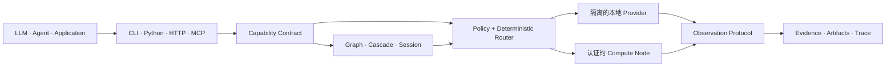

<div align="center">

# Specialist OS

**依赖能力，而不是模型。**

连接 AI 应用与专业智能的能力层。

[English](README.md) · [简体中文](README.zh-CN.md)

[](https://github.com/TsekaLuk/specialist-runtime/actions/workflows/ci.yml)
[](https://github.com/TsekaLuk/specialist-runtime/releases/latest)
[](https://pypi.org/project/specialist-runtime/)
[](LICENSE)

`CLI` · `Python SDK` · `HTTP` · `MCP` · `Rust Core`

</div>

Specialist OS 为 LLM、Agent 和应用提供 `vision.detect`、`vision.ocr`、
`audio.transcribe` 等稳定的能力名称。开源参考实现 `specialist-runtime`
负责发现 Provider、应用策略、选择硬件、执行 Specialist，并返回统一且可追溯的
结果协议。

应用依赖的是 Capability，而不是 YOLO、PaddleOCR、Whisper 或其他具体模型。
Provider 可以持续演进，上层业务代码不必随之改写。

> **生产边界：** Core Runtime 通过完整发布门禁，且不强制依赖第三方运行库。
> 可选模型 Provider 安装在隔离环境中，并拥有独立的真实模型验收通道。
> 无依赖 fallback 适合验证接口，但绝不会被当作模型质量证据。

## 为什么是 Specialist OS

| | Runtime 保证什么 |
| --- | --- |
| **稳定能力契约** | 稳定的能力名称、输入输出 Schema 和语义保证 |
| **默认确定性** | 基于 Policy、硬件和 Benchmark 路由，核心决策链不调用 LLM |
| **结果可验证** | Observation、Evidence、Provenance、Confidence、Metrics、Artifact 与 Trace |
| **能力可组合** | DAG、置信度 Cascade、Fallback 与有状态流式 Session |
| **本地优先分布式执行** | 隔离的本地 Worker 与 Token 认证的 HTTP Compute Node |
| **开放 Provider 生态** | 纯数据 Manifest、Adapter SDK、Capability Pack 与许可证元数据 |

## 架构



Specialist OS 刻意不成为 Agent Framework、Chatbot、RAG Framework 或通用
Model Gateway。它位于这些系统之下，为机器感知和专业计算提供操作层。

## 快速开始

使用 [uv](https://docs.astral.sh/uv/) 从源码安装：

```bash
git clone https://github.com/TsekaLuk/specialist-runtime.git
cd specialist-runtime
uv tool install .

specialist doctor
specialist capabilities --json
```

在全新机器上验证无依赖接口链路：

```bash
printf 'Specialist OS' > note.txt
specialist ocr note.txt --json
```

安装并强制使用真实 Provider 完成生产推理：

```bash
specialist --backend real --with-dependencies install vision.ocr
specialist --backend real --isolate ocr invoice.png --json
```

Runtime 数据默认保存在 `~/.specialist/`。可以通过 `SPECIALIST_HOME` 指定独立
目录。真实 Provider 缺少必要模型 Artifact 或 SHA256 校验失败时会直接拒绝执行。

## 真实 Provider 结果

下图是 Specialist Runtime 的真实推理结果，不是 mock，也不是概念插图。
Runtime 对 Ultralytics YOLO11s Artifact 完成 SHA256 校验后，在统一结果协议中
返回了 1 辆公交车和 4 个人及其置信度。

<p align="center">
  
</p>

<p align="center"><sub>Provider：<code>yolo</code> · Model：<code>yolo11s</code> · Package：<code>ultralytics==8.3.0</code> · Device：CPU · Input：<a href="https://www.ultralytics.com/images/bus.jpg">Ultralytics bus.jpg</a></sub></p>

使用 Registry 中锁定的 Artifact 复现：

```bash
curl -L https://www.ultralytics.com/images/bus.jpg -o bus.jpg
specialist --backend real --isolate install vision.detect \
  --source https://github.com/ultralytics/assets/releases/download/v8.3.0/yolo11s.pt \
  --sha256 85a76fe86dd8afe384648546b56a7a78580c7cb7b404fc595f97969322d502d5
specialist --backend real --isolate detect bus.jpg --json
```

## 核心能力

| Capability | 参考 Provider | CLI |
| --- | --- | --- |
| `vision.detect` | YOLO | `specialist detect` |
| `vision.segment` | SAM | `specialist segment` |
| `vision.ocr` | PaddleOCR | `specialist ocr` |
| `vision.depth` | Depth Anything V2 | `specialist depth` |
| `screen.parse` | OmniParser | `specialist parse-screen` |
| `document.parse` | MinerU | `specialist parse-document` |
| `audio.transcribe` | whisper.cpp | `specialist transcribe` |
| `audio.vad` | Silero VAD | `specialist vad` |

可以安装单项能力、Capability Pack 或完整参考能力集：

```bash
specialist install vision.ocr
specialist pack list
specialist pack install vision-core
specialist install all
```

## Advanced Runtime

不执行推理，直接检查 Provider 选择与每个候选被拒绝的原因：

```bash
specialist explain vision.depth \
  --options '{"profile":"quality","max_memory_mb":4096}'
```

在不导入第三方代码的前提下校验并登记 Provider Manifest：

```bash
specialist provider validate ./manifest.json
specialist provider install ./manifest.json
specialist provider list
```

测量真实本地执行，并检查控制平面：

```bash
specialist bench vision.ocr invoice.png --runs 5
specialist node list
specialist studio snapshot
```

通过 Python SDK 把已注册能力组成 DAG，并打开有状态 Session：

```python
from specialist import Specialist

sp = Specialist()

graph = sp.graph("document-inspection")
graph.add("ocr", "vision.ocr")
graph.add("depth", "vision.depth")
graph.add("scene", "screen.parse", depends_on=("ocr", "depth"))
run = sp.runtime.run_graph(graph, "page.png")

session = sp.open_session("audio.vad")
event = session.push(audio_bytes)
events = session.poll()
session.close()
```

每个成功结果都遵循
[Observation Protocol Schema](schemas/result-envelope.schema.json)。较大的 Provider
输出会写入内容寻址 Artifact Store，而不是直接塞入 JSON。Artifact ID 可以通过
SHA256 校验，解析路径时也会拒绝符号链接穿越。

## 调用接口

### Python

```python
from specialist import Specialist

sp = Specialist(backend="real", isolate=True)
result = sp.ocr("invoice.png")
print(result["result"]["blocks"])
```

### HTTP

Server 默认只监听 loopback。绑定非 loopback 地址时必须配置 Bearer Token，否则
Runtime 会拒绝启动。

```bash
export SPECIALIST_API_TOKEN="$(openssl rand -hex 32)"
specialist serve --port 8741 --token "$SPECIALIST_API_TOKEN"

curl -s http://127.0.0.1:8741/health
curl -s http://127.0.0.1:8741/ready
curl -s http://127.0.0.1:8741/metrics
curl -s -X POST http://127.0.0.1:8741/v1/vision/ocr \
  -H "Authorization: Bearer $SPECIALIST_API_TOKEN" \
  -H 'Content-Type: application/json' \
  -d '{"path":"invoice.png"}'
```

### MCP

```bash
specialist serve --mcp
```

stdio Server 为全部 8 个核心工具实现 `initialize`、`tools/list` 和 `tools/call`。
工具定义由 Capability Registry 生成。

## 生产验收

默认 E2E 会使用临时 Runtime Home，启动真实 CLI、HTTP、MCP、Worker 和 Remote
Node 进程边界。它在不下载模型权重的情况下验证传输与生命周期行为：

```bash
python -m unittest discover -s tests/e2e -v
```

可执行证据位于
[CLI E2E](tests/e2e/test_cli_e2e.py)、
[HTTP E2E](tests/e2e/test_http_e2e.py)、
[MCP E2E](tests/e2e/test_mcp_e2e.py) 和
[Remote Node E2E](tests/e2e/test_remote_e2e.py)。本 README 不使用手工制作的
E2E 截图。

在已经安装 Provider Package 和锁定模型 Artifact 的机器上运行独立的真实
Provider 验收：

```bash
SPECIALIST_RUN_REAL_PROVIDER_E2E=1 \
SPECIALIST_REAL_PROVIDERS=yolo,sam,paddleocr,silero,whisper \
python -m unittest discover -s tests/e2e -p test_real_provider_e2e.py -v
```

| Provider | 生产依赖 | 离线边界 |
| --- | --- | --- |
| YOLO / SAM | `ultralytics==8.3.0` | 锁定的 `.pt` Artifact |
| PaddleOCR | `paddleocr==3.7.0`、`paddlepaddle==3.3.1` | PP-OCRv5 det/rec Bundle；禁用额外阶段 |
| Depth Anything | `transformers==4.57.3`、`torch==2.14.0` | 启用 `local_files_only` 的本地 Hugging Face Bundle |
| Silero VAD | `silero-vad==6.2.1`、`torch==2.14.0` | 经过校验的 `.jit` Artifact |
| whisper.cpp | 运维提供的 `whisper-cli` | 经过校验的 `ggml-base.en.bin` |
| MinerU | `mineru==3.4.5` | 经过校验的 Wheel 与运维提供的本地模型 |
| OmniParser | 运维提供的 JSON CLI | 通过 `OMNIPARSER_MODEL_DIR` 暴露的校验 Bundle |

生产发布前执行：

```bash
specialist --backend real doctor --strict --json
python scripts/release_check.py --require-artifacts
SPECIALIST_RUN_PACKAGE_E2E=1 \
  python -m unittest discover -s tests/e2e -p test_package_e2e.py -v
```

网络服务必须配置 Token，第三方 Provider 应在隔离 Worker 中执行，同时需要检查
上游代码与模型权重的许可证。完整生产边界参见
[部署指南](docs/deployment.md)和[安全策略](SECURITY.md)。

## Rust + Python

Python 负责 SDK、传输层与 Provider 生态；Rust 负责适合原生实现的确定性原语，
提供更快执行、强类型和稳定实现。Rust 扩展是可选项：

```bash
uv tool install maturin
PYO3_USE_ABI3_FORWARD_COMPATIBILITY=1 \
  maturin develop --manifest-path rust-core/Cargo.toml --features python
```

没有安装扩展时，Python 会自动使用行为等价的实现。

## 开发

```bash
uv sync --locked
python -m unittest discover -s tests -v
python -m unittest discover -s tests/e2e -v
cargo test --manifest-path rust-core/Cargo.toml
python scripts/release_check.py --require-artifacts
```

CI 覆盖 Python 3.10–3.13、macOS ARM64、Wheel 安装、Rust/Python ABI 检查、
`pip-audit`、`cargo audit`、发布元数据和 CycloneDX SBOM 生成。Release Tag 还会
发布 Checksum 与 Build Provenance。

欢迎参与贡献。新增 Provider 或修改 Capability Contract 前，请阅读
[CONTRIBUTING.md](CONTRIBUTING.md)。

Specialist Runtime 使用 [MIT License](LICENSE)。Provider 代码和模型权重保留各自
许可证，具体记录在 Registry 中。
